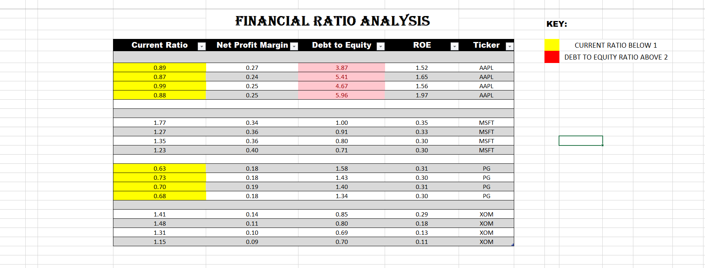
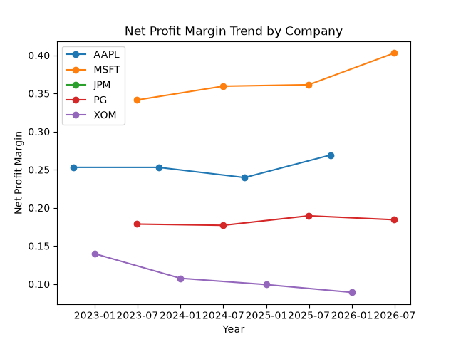

# Financial Statement Analyzer

Automated tool that pulls real financial statements for multiple companies, 
calculates key financial ratios, flags red/yellow risk indicators, and 
exports a formatted Excel report with trend charts.

## What it does
- Pulls income statement, balance sheet, and cash flow data for 5 companies 
  across different industries (AAPL, MSFT, JPM, PG, XOM) using the yfinance API
- Calculates Current Ratio, Net Profit Margin, Debt-to-Equity, and ROE for 
  each company across multiple years
- Handles industry-specific data differences (e.g. banks like JPM don't 
  report a standard Current Assets/Liabilities split — excluded with a 
  clear error message rather than crashing)
- Exports results to a formatted Excel workbook with conditional formatting 
  to flag risk indicators
- Generates a chart comparing Net Profit Margin trends across companies
- Includes written analysis interpreting the results (see `analysis.md`)

## Tools used
Python, pandas, yfinance, openpyxl, matplotlib, Excel (formatting layer)

## Sample output

### Ratio table (Excel, with conditional formatting)

### Net Profit Margin trend

## How to run it
1. Clone this repo
2. Install dependencies: `pip install yfinance pandas openpyxl matplotlib`
3. Run: `python main.py`
4. Output is saved to the `data/` folder as `financial_analysis.xlsx` and 
   `profit_margin_trend.png`

## Key insight
Apple's ROE is unusually high (150–190%) not due to operational strength 
alone but largely driven by aggressive stock buybacks shrinking its equity 
base — a reminder that ratios need context, not just face-value reading. 
Full analysis in `analysis.md`.